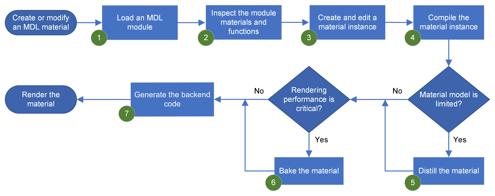

# An introduction to the NVIDIA MDL SDK 

The NVIDIA&reg; Material Definition Language (MDL) SDK is an open source
set of tools that enable the integration of physically-based materials
into rendering applications.

## Preface 

This README introduces the MDL SDK. It describes the target
[audience](#audience), the [purpose](#purpose) of the SDK, an
[example workflow](#example-usage) and
[running example programs](#getting-started-using-the-sdk) that
illustrate the implementation of core MDL concepts.

***Related information:***

* For installation instructions, see ["Building the MDL SDK from Source"](INSTALL.md)
* For a brief introduction to MDL, see ["What is MDL"](#what-is-mdl)

## Audience 

Software developers responsible for integrating MDL into applications with
2D or 3D graphics capabilities.

***Prerequisite skills:***

* A working knowledge of C++
* Familiarity with fundamental 3D graphics concepts

## What is MDL?

### Material definition language 

NVIDIA Material Definition Language (MDL) is a domain-specific programming
language that you use to define physically-based materials and lights for
rendering. It is designed for the definition of the highest quality materials,
fast rendering, and serves as an industry standard for material exchange.

### MDL materials 

Materials consist of two parts -- A *material definition* and *functions*:

* The *material definition* is declarative and based on a robust material model.
    
    **Example:** The following code snippet is a simple declarative material
    definition.  In the example, the material `generic_diffuse_material` defines
    a single material parameter  `diffuse_color`.  This parameter is used to
    define the color for the diffuse reflection BSDF `diffuse_reflection_bsdf`.

        export material diffuse( color diffuse_color = color(0.7))
            = material(
                surface: material_surface (
                    scattering: df::diffuse_reflection_bsdf (
                        tint: diffuse_color
                    )
                )
            );

* *The functions*, which are written in a procedural programming language,
  compute parameter values for the material model.
    
    **Example:** In the following code snippet, the `tiles` function computes
    the color for a tile at a particular texture coordinate to define a
    checkerboard. The parameters define the number of tiles in one direction
    and the two colors for the black and white tiles. The computation uses
    math functions from the MDL standard math library.

        export color tiles( int no_tiles,
                            color black = color(0.1),
                            color white = color(0.8))
        {
            float3 uvw = step(0.5, frac( no_tiles/2 * state::texture_coordinate(0)));
            float black_or_white = frac((uvw.x + uvw.y)*0.5)*2.0;
            return lerp( black, white, black_or_white);
        }

    The following code snippet uses the `tiles` function to define a
    checkerboard material with eight times eight tiles per uv unit square.

        export material checker() = diffuse( tiles( 8));

    Refer to [Material Definition Language Handbook](http://mdlhandbook.com/) for
    more details on the MDL language.

***Related information:*** For detailed information about MDL, the underlying
concepts, and creating MDL materials, see the
[MDL documentation](https://raytracing-docs.nvidia.com/mdl/index.html).

## What is the MDL SDK?

The following sections describe the purpose of the MDL SDK, an example
workflow supported by the SDK, and a link to the installation instructions.

### Purpose

The MDL SDK is a toolkit delivered as an open source C++ library. It is
designed to support a wide range of material workflows in new or existing
applications.

### Example usage

The following figure illustrates an example workflow for material creation:

The callouts in the figure are described below. Each callout describes
how a specific SDK component supports this material workflow:

1.   **MDL modules:**
You use the module mechanism to package materials and functions for re-use.
An MDL module contains one or more material and function definitions. When
you load a module it is parsed and validated by the MDL compiler and its
content is stored in an internal database.

2.   **Internal database:**
The internal database provides access to all material and function definitions. 

3.   **Transactions and call graphs:**
You create, edit, and store material instances and function calls using
transactions. The results are stored in the internal database. From
database entities, you can connect functions to material parameters and
build call graphs that express complex materials.

4.   **Compiled materials:**
You can compile these graphs into a compact optimized representation, which
is referred to as a *compiled material*. The compilation step includes
inlining of call expressions, constant folding and the elimination of
common subexpressions.

5.   **Distilling and texture baking:**
Distilling is a process for mapping or simplifying compiled MDL materials
to more limited material models used by specific renderers.

6.   **Texture baking:**
Baking textures ensures optimal rendering performance for game engines.

7.   **Backends:**
A compiled material is the basis for code generation.
The SDK provides the following backends for code generation:

     * CUDA PTX
     * LLVM 12 IR 
     * HLSL and GLSL
     * Native code generation for the CPU

The SDK also provides:

*   **Example programs:**
To help you get started using the MDL SDK, working example programs are
provided. See ["Getting started using the SDK"](#getting-started-using-the-sdk)
for an introduction to these example programs.

*   **Documentation:**
A detailed MDL specification, as well as conceptual, user, and reference
API documentation is included with the MDL SDK. You can also access this
documentation set from the
[NVIDIA Ray Tracing Documentation](https://raytracing-docs.nvidia.com/mdl/index.html)
website.

### Installing the SDK

Installations for the MDL SDK are provided for Linux, Windows, and macOS.
See ["Building the MDL SDK from Source"](INSTALL.md) for system requirements
and installation instructions.

# Getting started using the SDK 

To help you get up to speed quickly, the MDL SDK provides many example
programs that you can use as a starting point for the integration of MDL
into your application. The example programs are organized under
["The basics"](#the-basics), which covers concepts and implementation
details that all software developers need to understand, followed by
concepts and implementation details concerning the
[integration of MDL into a renderer](#integrating-mdl-into-a-renderer).

## The basics

The example programs listed in this section take you through the following
steps:

*   Loading, instantiating, and compiling materials
*   Generating target code for a compiled material

**Examples:**

*   *Basic SDK concepts:*

    [Example for Starting and Shutting Down the MDL SDK API](https://raytracing-docs.nvidia.com/mdl/api/mi_neuray_example_start_shutdown.html)
    shows how to start and shut down the MDL SDK API

*   *Loading a module and inspecting materials and functions exported from the module:*

    [Example for MDL Modules](https://raytracing-docs.nvidia.com/mdl/api/mi_neuray_example_modules.html)
    shows how to load an MDL module and inspect its contents
    
    [Example for Instantiation of MDL Definitions](https://raytracing-docs.nvidia.com/mdl/api/mi_neuray_example_instantiation.html)
    shows how to instantiate material and function definitions

*   *Creating call graphs and attaching functions to material parameters:* 

    [Example for Function Calls](https://raytracing-docs.nvidia.com/mdl/api/mi_neuray_example_calls.html) shows how to create a textured material by using a series of function calls

*   *Compiled materials---creating a compact and optimized representation of your material instance:* 

    [Example for Compilation of MDL Materials](https://raytracing-docs.nvidia.com/mdl/api/mi_neuray_example_compilation.html)
    shows how to perform class and instance compilation of material instances

*   *Overview of target code generation---common steps for all renderers:* 

    [Example for Generating Shader Code for an MDL Material](https://raytracing-docs.nvidia.com/mdl/api/mi_neuray_example_code_gen.html)
    shows how to generate HLSL, GLSL, or PTX code for a compiled material

## Integrating MDL into a renderer

The example programs listed in this section take you through the following
steps:

*   Compiling and executing functions and materials
*   Distilling and baking, which is intended for game engines and renderers
    with limited capabilities

### Compiling and executing functions

The example programs listed in this section describe the execution of code
generated for various backends and execution of material expressions:

**Examples:**

*   *CPU baking:*

    [Example for Execution of Compiled MDL Materials (CPU)](https://raytracing-docs.nvidia.com/mdl/api/mi_neuray_example_execution_native.html)
    shows how to execute material sub-expressions of a compiled MDL material
    for the native (CPU) backend

*   *CUDA baking:*

    [Example for Execution of Compiled MDL Materials (PTX)](https://raytracing-docs.nvidia.com/mdl/api/mi_neuray_example_execution_ptx.html)
    shows how to execute material sub-expressions of a compiled MDL material
    for the PTX backend with CUDA

*   *OpenGL baking:*

    [Example for Execution of Compiled MDL Materials (GLSL)](https://raytracing-docs.nvidia.com/mdl/api/mi_neuray_example_execution_glsl.html)
    shows how to execute material sub-expressions of a compiled MDL material
    for the GLSL backend with OpenGL

*   *Vulkan baking:*

    [Example for Execution of Compiled MDL Materials (GLSL Vulkan)](https://raytracing-docs.nvidia.com/mdl/api/mi_neuray_example_execution_glsl_vk.html)
    shows how to execute material sub-expressions of a compiled MDL material
    for the GLSL backend with Vulkan 

### Compiling and executing materials 

The example programs listed in this section take you through the following
steps:

*   Compiling and executing code for various backends
*   Compiling and executing distribution functions
*   Rendering with simple path tracers

**Examples:**

*   *CUDA renderer---using compiled BSDFs:*

    [Example for Compiled Distribution Functions (PTX)](https://raytracing-docs.nvidia.com/mdl/api/mi_neuray_example_df_cuda.html)
    shows how to use compiled material distribution functions in a CUDA-based
    renderer

*   *CPU renderer:*

    [Example for Integrating MDL into a Renderer by Using the Native Backend (CPU)](https://raytracing-docs.nvidia.com/mdl/api/mi_neuray_example_df_native.html)
    shows how to use compiled materials and an MDL native backend in a CPU-based
    renderer

*   *Vulkan renderer:*

    [Example for Compiled Distribution Functions (GLSL)](https://raytracing-docs.nvidia.com/mdl/api/mi_neuray_example_df_vulkan.html)
    shows how to use compiled materials and the GLSL backend in a Vulkan-based
    renderer

*   *CUDA renderer---enabling automatic derivatives:*

    [Example for Texture Filtering with Automatic Derivatives](https://raytracing-docs.nvidia.com/mdl/api/mi_neuray_example_derivatives.html)
    shows how to enable automatic derivatives for texture filtering.  
    **Note:** This example is useful for all renderers.

*   *DirectX renderer:*

    [Example for a Microsoft DXR-based MDL-enabled Path Tracer](https://raytracing-docs.nvidia.com/mdl/api/mi_neuray_example_dxr.html)
    shows how to use MDL materials to render glTF scenes.  
    **Note:** This is the most complete rendering example and it illustrates
    how to interface with MaterialX and glTF.

*   *OptiX framework:*

    [Example for Inlining MDL Code into Shaders (OptiX 7)](https://raytracing-docs.nvidia.com/mdl/api/mi_neuray_example_optix7.html)
    shows how to optimize the evaluation of MDL materials for OptiX 7.  
    **Note:** [OptiX](https://raytracing-docs.nvidia.com/optix8/index.html) is
    a scalable framework for building ray tracing based applications. (It is not
    a renderer.)

### Distilling and baking

Distilling and baking enable you to optimize MDL materials for game engines and renderers with limited capabilities.
The following examples provide an introduction to the MDL distilling mechanism and how to use it.

**Examples:**

*   *General introduction to distilling and baking:*

    [Example for Material Distilling and Baking](https://raytracing-docs.nvidia.com/mdl/api/mi_neuray_example_distilling.html) shows how to d[istill compiled materials and bake material sub-expressions

*   *Unity game engine---distilling and baking:*

    [Example for Material Distilling and Baking for Unity](https://raytracing-docs.nvidia.com/mdl/api/mi_neuray_example_distilling_unity.html)
    shows how to distill compiled materials and bake material sub-expressions
    for the Unity game engine

*   *Simple GLSL rasterizer---using baked textures or GLS code generation:*

    [Example for Using Distilled Materials in OpenGL](https://raytracing-docs.nvidia.com/mdl/api/mi_neuray_example_distilling_glsl.html)
    shows how to map distilled materials to a GLSL shader

    [Example for custom Distiller plugin](https://raytracing-docs.nvidia.com/mdl/api/mi_neuray_example_distilling_target.html)
    shows how to implement a custom distiller target

### Other topics

The following examples cover topics and use cases that may be important
to your particular MDL integration.

**Examples:**

*   *Traversing a compiled material:*

    [Example for Traversing Compiled Materials](https://raytracing-docs.nvidia.com/mdl/api/mi_neuray_example_traversal.html)
    shows how to traverse compiled MDL materials to reconstruct compilable
    MDL code

*   *Building a new MDL module:*

    [Example for building new MDL Modules](https://raytracing-docs.nvidia.com/mdl/api/mi_neuray_example_create_module.html)
    shows how to build a new MDL module

*   *Exploring the MDL module namespace:*

    [Example for the Discovery of MDL Modules](https://raytracing-docs.nvidia.com/mdl/api/mi_neuray_example_discovery.html)
    shows how to discover MDL modules in specified search paths and list them.

*   *Presenting discovered modules to a user:*

    [Example Implementation of an MDL Browser](https://raytracing-docs.nvidia.com/mdl/api/mi_neuray_example_mdl_browser.html)
    shows how to implement a material selection dialog for a material library

*   *Encapsulating an MDL material in MDLE:*

    [Example for Integrating the MDL Encapsulated Format](https://raytracing-docs.nvidia.com/mdl/api/mi_neuray_example_mdle.html)
    shows how to export and load materials or functions using the MDL
    encapsulated format.  
    **Note:** MDLE enables you to inline all external MDL dependencies.
    All textures and resources are stored in the package.

*   *Converting an AxF file to MDL:*

    [Example for converting from X-Rite AxF to MDL material formats](https://raytracing-docs.nvidia.com/mdl/api/mi_neuray_example_axf_to_mdl.html)
    shows how to convert an [X-Rite AxF](https://www.xrite.com/axf) file to MDL

## Additional resources

* [Material Definition Language Handbook](http://mdlhandbook.com/)
* [MDL SDK Reference Documentation (online)](https://raytracing-docs.nvidia.com/mdl/index.html)
* [NVIDIA vMaterials library](https://developer.nvidia.com/vmaterials)
* [NVIDIA MDL SDK Forum](https://devtalk.nvidia.com/default/board/253/mdl-sdk/)
* [License](LICENSE.md)
* [Installation Instructions](INSTALL.md)
* [Change Log](CHANGELOG.md)
* [Contributors License Agreement](CONTRIBUTING.md)
