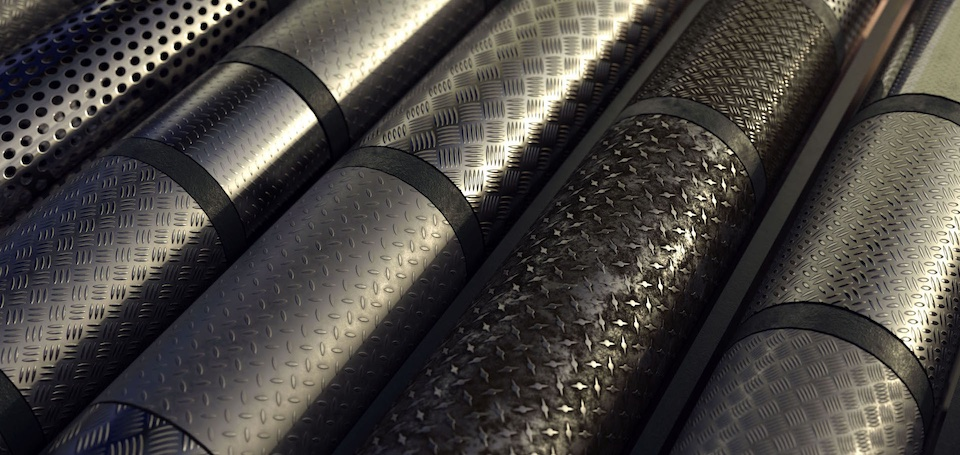
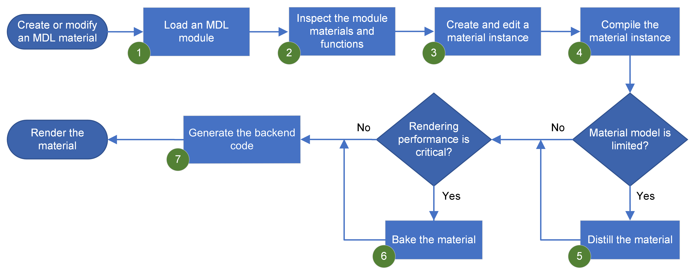

# NVIDIA MDL SDK

The NVIDIA&reg; Material Definition Language (MDL) SDK is an open-source
set of tools that enable the integration of physically-based materials
into rendering applications.

## Preface

This README introduces the MDL SDK. It describes the target
[audience](#audience), the [purpose](#purpose) of the SDK, an
[example workflow](#example-usage), and
[running example programs](#getting-started-using-the-sdk) that
illustrate the implementation of core MDL concepts.

For additional information:

* For installation instructions, see ["Building the MDL SDK from Source"](INSTALL.md)
* For a brief introduction to MDL, see ["What is MDL"](#what-is-mdl)

## Audience

Software developers integrating MDL into applications with
2D or 3D graphics capabilities.

Prerequisite skills:

* A working knowledge of C++
* Familiarity with fundamental 3D graphics concepts

## What is MDL?

### Material definition language

NVIDIA Material Definition Language (MDL) is a domain-specific programming
language that you use to define physically-based materials and lights for
rendering. It is designed for the definition of the highest quality materials,
fast rendering, and serves as an industry standard for material exchange.

### MDL materials

Materials consist of two parts: a *material definition* and *functions*:

* The *material definition* is declarative and based on a robust material model.

    **Example:** The following code snippet is a simple declarative material
    definition. In the example, the material `diffuse` defines
    a single material parameter `diffuse_color`. This parameter is used to
    define the color for the diffuse reflection BSDF `diffuse_reflection_bsdf`.

        export material diffuse( color diffuse_color = color(0.7))
            = material(
                surface: material_surface (
                    scattering: df::diffuse_reflection_bsdf (
                        tint: diffuse_color
                    )
                )
            );

* The *functions*, which are written in a procedural programming language,
  compute parameter values for the material model.

    **Example:** In the following code snippet, the `tiles` function computes
    the color for a tile at a particular texture coordinate to define a
    checkerboard. The parameters define the number of tiles in one direction
    and the two colors for the black and white tiles. The computation uses
    math functions from the MDL standard math library.

        export color tiles( int no_tiles,
                            color black = color(0.1),
                            color white = color(0.8))
        {
            float3 uvw = step(0.5, frac( no_tiles/2 * state::texture_coordinate(0)));
            float black_or_white = frac((uvw.x + uvw.y)*0.5)*2.0;
            return lerp( black, white, black_or_white);
        }

    The following code snippet uses the `tiles` function to define a
    checkerboard material with eight times eight tiles per UV unit square.

        export material checker() = diffuse( tiles( 8));

    Refer to the [Material Definition Language Handbook](https://mdlhandbook.com/) for
    more details on the MDL language.

***Related information:*** For detailed information about MDL, the underlying
concepts, and creating MDL materials, see the
[MDL documentation](https://raytracing-docs.nvidia.com/mdl/index.html).

## What is the MDL SDK?

The following sections describe the purpose of the MDL SDK, an example
workflow supported by the SDK, and a link to the installation instructions.

### Purpose

The MDL SDK is a toolkit delivered as an open-source C++ library. It is
designed to support a wide range of material workflows in new or existing
applications.

### Example usage

The following figure illustrates an example workflow for material creation:

The callouts in the figure are described below. Each callout describes
how a specific SDK component supports this material workflow:

1. **MDL modules:** You use the module mechanism to package materials and
   functions for reuse. An MDL module contains one or more material and
   function definitions. When you load a module, it is parsed and validated
   by the MDL compiler and its content is stored in an internal database.

2. **Internal database:** The internal database provides access to all material
   and function definitions.

3. **Transactions and call graphs:** You create, edit, and store material
   instances and function calls using transactions. The results are stored in
   the internal database. From database entities, you can connect functions to
   material parameters and build call graphs that express complex materials.

4. **Compiled materials:** You can compile these graphs into a compact optimized
   representation, which is referred to as a *compiled material*. The
   compilation step includes inlining of call expressions, constant folding,
   and the elimination of common subexpressions.

5. **Distilling:** Distilling is a process for mapping or simplifying compiled
   MDL materials to more limited material models used by specific renderers.

6. **Texture baking:** Baking textures ensures optimal rendering performance
   for game engines.

7. **Backends:** A compiled material is the basis for code generation. The SDK
   provides the following backends for code generation:

   * CUDA PTX
   * LLVM IR
   * HLSL and GLSL
   * Native code generation for the CPU

The SDK also provides:

* **Example programs:** To help you get started using the MDL SDK, working
  example programs are provided. See
  ["Getting started using the SDK"](#getting-started-using-the-sdk) for an
  introduction to these example programs.

* **Documentation:** The MDL SDK includes a detailed MDL specification and
  conceptual, user, and API reference documentation. You can also access this
  documentation set from the
  [NVIDIA Ray Tracing Documentation](https://raytracing-docs.nvidia.com/mdl/index.html)
  website.

### Installing the SDK

Prebuilt MDL SDK packages for Linux, Windows, and macOS are available from the
[releases page](https://github.com/NVIDIA/MDL-SDK/releases).

See ["Building the MDL SDK from Source"](INSTALL.md) for system requirements and
build instructions.

## Getting started using the SDK

The MDL SDK includes example programs that cover the complete integration
workflow, from loading a module to rendering complete scenes. The example
sources are located in `examples/mdl_sdk`.

### Learn the MDL SDK workflow

These examples form a practical introduction to the core SDK concepts.

| Goal | Example | What it demonstrates |
|------|---------|----------------------|
| Initialize the SDK | [`start_shutdown`](https://raytracing-docs.nvidia.com/mdl/api/mi_neuray_example_start_shutdown.html) | Loading, starting, and shutting down the SDK |
| Inspect a module | [`modules`](https://raytracing-docs.nvidia.com/mdl/api/mi_neuray_example_modules.html) | Loading a module and inspecting its exported definitions |
| Instantiate definitions | [`instantiation`](https://raytracing-docs.nvidia.com/mdl/api/mi_neuray_example_instantiation.html) | Creating material and function instances |
| Build call graphs | [`calls`](https://raytracing-docs.nvidia.com/mdl/api/mi_neuray_example_calls.html) | Connecting functions to material parameters |
| Compile materials | [`compilation`](https://raytracing-docs.nvidia.com/mdl/api/mi_neuray_example_compilation.html) | Class and instance compilation |
| Generate target code | [`code_gen`](https://raytracing-docs.nvidia.com/mdl/api/mi_neuray_example_code_gen.html) | Generating HLSL, GLSL, PTX, or native code |

### Execute generated code

These focused examples show how to execute compiled material expressions with
different backends and graphics APIs.

| Runtime | Example | Backend | Requirements |
|---------|---------|---------|--------------|
| CPU | [`execution_native`](https://raytracing-docs.nvidia.com/mdl/api/mi_neuray_example_execution_native.html) | Native CPU | Basic SDK |
| CUDA | [`execution_cuda`](https://raytracing-docs.nvidia.com/mdl/api/mi_neuray_example_execution_ptx.html) | PTX | CUDA |
| OpenGL | [`execution_glsl`](https://raytracing-docs.nvidia.com/mdl/api/mi_neuray_example_execution_glsl.html) | GLSL | OpenGL |
| Vulkan | [`execution_glsl_vk`](https://raytracing-docs.nvidia.com/mdl/api/mi_neuray_example_execution_glsl_vk.html) | GLSL | Vulkan |

### Complete renderer integration

The [`dxr`](https://raytracing-docs.nvidia.com/mdl/api/mi_neuray_example_dxr.html)
example is the most comprehensive renderer included with the MDL SDK. It
demonstrates end-to-end MDL integration in a DirectX Raytracing path tracer,
including loading and rendering complete glTF scenes.

| Example | Scene support | Backend | Requirements |
|---------|---------------|---------|--------------|
| [`dxr`](https://raytracing-docs.nvidia.com/mdl/api/mi_neuray_example_dxr.html) | Complete glTF and GLB scenes with MDL materials | HLSL, DirectX Raytracing | Windows, DirectX 12 |

### Focused renderer examples

These examples concentrate on individual backend and renderer integration
techniques using simple procedural geometry.

| Example | Focus | Geometry | Backend |
|---------|-------|----------|---------|
| [`df_native`](https://raytracing-docs.nvidia.com/mdl/api/mi_neuray_example_df_native.html) | CPU execution of compiled distribution functions | Sphere or hair | Native CPU |
| [`df_cuda`](https://raytracing-docs.nvidia.com/mdl/api/mi_neuray_example_df_cuda.html) | GPU execution of compiled distribution functions | Sphere or hair | PTX |
| [`df_vulkan`](https://raytracing-docs.nvidia.com/mdl/api/mi_neuray_example_df_vulkan.html) | Distribution functions in a Vulkan path tracer | Sphere | GLSL |
| [`optix7`](https://raytracing-docs.nvidia.com/mdl/api/mi_neuray_example_optix7.html) | Inlining generated MDL code into [OptiX](https://raytracing-docs.nvidia.com/optix8/index.html) shaders | Sphere or cube | PTX, OptiX 7 |

Several renderers also support
[automatic derivatives](https://raytracing-docs.nvidia.com/mdl/api/mi_neuray_example_derivatives.html)
for texture filtering.

The [spectral rendering](https://raytracing-docs.nvidia.com/mdl/api/mi_neuray_example_spectral_rendering.html) guide explains how to integrate spectral rendering into an application using the
extended `df_native` example as its primary reference. The `df_cuda`,
`df_vulkan`, and `dxr` examples also demonstrate spectral rendering.

### Distill, bake, and convert materials

| Goal | Example | What it demonstrates |
|------|---------|----------------------|
| Bake material expressions | [`baking`](https://raytracing-docs.nvidia.com/mdl/api/mi_neuray_example_baking.html) | Baking material sub-expressions to textures or constants without distilling |
| Distill and bake materials | [`distilling`](https://raytracing-docs.nvidia.com/mdl/api/mi_neuray_example_distilling.html) | Distilling compiled materials and baking material expressions |
| Prepare materials for Unity | [`distilling_unity`](https://raytracing-docs.nvidia.com/mdl/api/mi_neuray_example_distilling_unity.html) | Distilling and baking for the Unity material model |
| Render distilled materials | [`distilling_glsl`](https://raytracing-docs.nvidia.com/mdl/api/mi_neuray_example_distilling_glsl.html) | Mapping distilled materials to GLSL shaders |
| Implement a distiller target | [`distilling_target`](https://raytracing-docs.nvidia.com/mdl/api/mi_neuray_example_distilling_target.html) | Creating a custom distiller target plugin |
| Package materials | [`mdle`](https://raytracing-docs.nvidia.com/mdl/api/mi_neuray_example_mdle.html) | Exporting and loading self-contained MDLE packages |
| Convert measured materials | [`axf_to_mdl`](https://raytracing-docs.nvidia.com/mdl/api/mi_neuray_example_axf_to_mdl.html) | Converting [X-Rite AxF](https://www.xrite.com/axf) files to MDL |

### Author, discover, and inspect content

| Goal | Example | What it demonstrates |
|------|---------|----------------------|
| Traverse a compiled material | [`traversal`](https://raytracing-docs.nvidia.com/mdl/api/mi_neuray_example_traversal.html) | Reconstructing compilable MDL code |
| Build an MDL module | [`create_module`](https://raytracing-docs.nvidia.com/mdl/api/mi_neuray_example_create_module.html) | Creating modules programmatically |
| Discover modules and packages | [`discovery`](https://raytracing-docs.nvidia.com/mdl/api/mi_neuray_example_discovery.html) | Exploring configured MDL search paths |
| Present a material library | [`mdl_browser`](https://raytracing-docs.nvidia.com/mdl/api/mi_neuray_example_mdl_browser.html) | Implementing a material selection interface |
| Inspect module dependencies | [`dependency_inspector`](https://raytracing-docs.nvidia.com/mdl/api/mi_neuray_example_dependency_inspector.html) | Listing imports and resource dependencies |
| Resolve MDL resources | [`entity_resolver`](https://raytracing-docs.nvidia.com/mdl/api/mi_neuray_example_entity_resolver.html) | Implementing a custom entity resolver |

## Additional resources

### External resources

* [Material Definition Language Handbook](https://mdlhandbook.com/)
* [MDL SDK reference documentation](https://raytracing-docs.nvidia.com/mdl/index.html)
* [NVIDIA vMaterials library](https://developer.nvidia.com/vmaterials)
* [NVIDIA MDL SDK forum](https://forums.developer.nvidia.com/c/gaming-and-visualization-technologies/visualization/mdl-sdk)

### Project documents

* [License](LICENSE.md)
* [Installation Instructions](INSTALL.md)
* [Change Log](CHANGELOG.md)
* [Contributor License Agreement](CONTRIBUTING.md)
* [Security Policy](SECURITY.md)
