# Introduction

The Material Definition Language (MDL) module `nvidia::core_definitions` contains a collection of
MDL materials. These materials can be used either independently ("simple materials") or in
combination with other materials through the use of material combiners and modifiers. Texturing
functions provide further control and refinement of material parameter values. Together, materials,
combiners, modifiers and the texturing functions can simulate complex, real-world models of
appearance.

The core definition materials are listed in [Materials and building
blocks](#materials-and-building-blocks). The materials are divided into three groups:

* [Simple materials](#simple-materials) are used either individually to model visual appareance or
  as components when creating more complex materials with material combiners and material
  modifiers.

* [Modifier materials](#modifier-materials) are used to create new materials based on already
  existing materials. They either combine multiple materials into a new material or add additional
  features to an existing one.

* [Emissive materials](#emissive-materials) create light sources from objects by defining how light
  is emitted from an object's surface.

The functions and enumerations ("enums") used by the core materials are described in [Texturing
functions](#texturing-functions) and [Enumerations](#enumerations), respectively.

For materials and functions, two tables describe their parameters. The first lists the "display
names" used by applications for each parameter and a description of that parameter's role in the
material or function. The second table lists the display name along with that parameter's data
type, identifier, and default value. The tables in [Enumerations](#enumerations) list the field
names and their meaning.

# Materials and building blocks

## Simple materials

## Simple diffuse

MDL identifier: `core_definitions::diffuse`

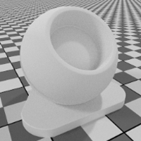

A basic diffuse material

| Display name | Description |
| ------------ | ----------- |
| Color | The color of the material |
| Diffuse roughness | Higher roughness values lead a powdery appearance |
| Bumps | Attach bump or normal maps here |

| Display name | Type | Parameter | Default |
| ------------ | ---- | --------- | ------- |
| Color | `color` | `diffuse_color` | `color(0.8)` 
| Diffuse roughness | `float` | `roughness` | `0.0` 
| Bumps | `float3` | `normal` | `state::normal()` 

## Metal

MDL identifier: `core_definitions::scratched_metal_v2`

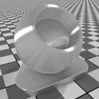

A metallic material with stretched reflections

| Display name | Description |
| ------------ | ----------- |
| Color | The color of the metal |
| Roughness | Higher roughness values lead to bigger highlights and blurry reflections |
| Reflection weight | Intensity of highlights and glossy reflections and highlights |
| Anisotropy | Higher values will stretch the highlight |
| Anisotropy rotation | Changes the orientation of the anisotropy. A value of 1 will rotate the orientation 360 degrees. |
| Bumps | Attach bump or normal maps here |

| Display name | Type | Parameter | Default |
| ------------ | ---- | --------- | ------- |
| Color | `color` | `metal_color` | `color(0.9)` 
| Roughness | `float` | `roughness` | `0.2` 
| Reflection weight | `float` | `glossy_weight` | `0.9` 
| Anisotropy | `float` | `anisotropy` | `0.0` 
| Anisotropy rotation | `float` | `anisotropy_rotation` | `0.0` 
| Bumps | `float3` | `normal` | `state::normal()` 

## Plastic

MDL identifier: `core_definitions::scratched_plastic_v2`

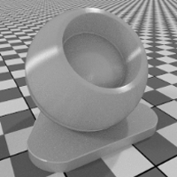

A basic dielectric, works for everything opaque that is not metallic. Supports stretched highlights.

| Display name | Description |
| ------------ | ----------- |
| Color | The color of the material |
| Roughness | Higher roughness values lead to bigger highlights and blurry reflections |
| Anisotropy | Higher values will stretch the highlight |
| Anisotropy rotation | Changes the orientation of the anisotropy. A value of 1 will rotate the orientation 360 degrees. |
| IOR | Determines reflectivity |
| Reflection weight | Additional reflectivity control |
| Bumps | Attach bump or normal maps here |

| Display name | Type | Parameter | Default |
| ------------ | ---- | --------- | ------- |
| Color | `color` | `diffuse_color` | `color(0.5)` 
| Roughness | `float` | `roughness` | `0.2` 
| Anisotropy | `float` | `anisotropy` | `0.0` 
| Anisotropy rotation | `float` | `anisotropy_rotation` | `0.0` 
| IOR | `uniform float` | `ior` | `1.4` 
| Reflection weight | `float` | `reflectivity` | `1.0` 
| Bumps | `float3` | `normal` | `state::normal()` 

## Retroreflective

MDL identifier: `core_definitions::retroreflective`

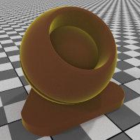

A material with a retroreflective component, works well for road signs and retroreflective stickers

| Display name | Description |
| ------------ | ----------- |
| Color | The color of the material |
| Reflection color | The color of the retroreflection |
| Roughness | Higher roughness values lead to bigger highlights and blurry reflections |
| Reflection weight facing | Reflectivity control for geometry facing the viewer |
| Reflection weight edge | Reflectivity control for the reflectivity at geometry edges |
| Bumps | Attach bump or normal maps here |

| Display name | Type | Parameter | Default |
| ------------ | ---- | --------- | ------- |
| Color | `color` | `base_color` | `color(0.2,0.23,0.23)` 
| Reflection color | `color` | `reflection_color` | `color(0.8,0.8,0.83)` 
| Roughness | `float` | `roughness` | `0.15` 
| Reflection weight facing | `float` | `normal_reflectivity` | `0.05` 
| Reflection weight edge | `float` | `grazing_reflectivity` | `1.0` 
| Bumps | `float3` | `normal` | `state::normal()` 

## Flexible material model

MDL identifier: `core_definitions::flex_material_v2`

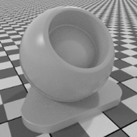

A complex material that can be configured to a wide variety of looks

| Display name | Description |
| ------------ | ----------- |
| Base color | The color of the material |
| Diffuse roughness | Higher roughness values lead to a more `powdery` look |
| Metallic material | If 1.0, reflection will be colored and independent of view direction. If 0.0, reflection will be white and direction dependent. Directional dependence is in this case based on the IOR (Fresnel effect). |
| Reflection weight | Controls the amount of reflection |
| Reflection roughness | Higher roughness values lead to more blurry reflections |
| Reflection anisotropy | Higher values will stretch the highlight |
| Anisotropy rotation | Changes the orientation of the anisotropy. A value of 1 will rotate the orientation 360 degrees. |
| Transmission weight | Weights how much light passes through the object compared to its diffuse reflectivity. |
| Transmission color | Color effect for transmission independent of thickness of the object, similar to stained glass. |
| Volume color | If the material is not `Thin walled`, `Volume color` will be reached at `Volume reference distance` (m). |
| Transmission roughness | higher values lead to objects seen through the material to appear blurry |
| Volume reference distance | If the material is not `Thin walled`, `Volume color` will be reached at this distance (m). Enter a typical thickness of objects made of this material here. |
| IOR | Determines refraction in the volume. It also influences the reflectivity for materials that are not metallic. |
| Thin walled | Thin walled materials do not refract and do not have volume effects. Good for soap bubbles or window glass. |
| Bumps | Attach bump or normal maps here |
| Abbe number | Controls dispersion. A value of 0 switches dispersion off. Dispersive materials have Abbe numbers between 25 and 85 |

| Display name | Type | Parameter | Default |
| ------------ | ---- | --------- | ------- |
| Base color | `color` | `base_color` | `color(0.5)` 
| Diffuse roughness | `float` | `diffuse_roughness` | `0.0` 
| Metallic material | `float` | `is_metal` | `0.0` 
| Reflection weight | `float` | `reflectivity` | `1.0` 
| Reflection roughness | `float` | `reflection_roughness` | `0.3` 
| Reflection anisotropy | `float` | `anisotropy` | `0.0` 
| Anisotropy rotation | `float` | `anisotropy_rotation` | `0.0` 
| Transmission weight | `float` | `transparency` | `0.0` 
| Transmission color | `color` | `transmission_color` | `color(1.0)` 
| Volume color | `uniform color` | `volume_color` | `color(1.0)` 
| Transmission roughness | `float` | `transmission_roughness` | `0.0` 
| Volume reference distance | `uniform float` | `base_thickness` | `0.1` 
| IOR | `uniform float` | `ior` | `1.5` 
| Thin walled | `uniform bool` | `thin_walled` | `false` 
| Bumps | `float3` | `normal` | `state::normal()` 
| Abbe number | `uniform float` | `abbe_number` | `0.0` 

## Thin glass

MDL identifier: `core_definitions::thin_glass_v2`

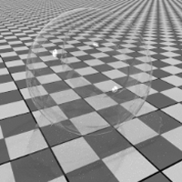

A basic transmissive dielectric without refraction or volume

| Display name | Description |
| ------------ | ----------- |
| Transmission color | The color of the material |
| Roughness | Higher roughness values lead to bigger highlights and blurry reflections |
| IOR | Determines reflectivity |
| Bumps | Attach bump or normal maps here |

| Display name | Type | Parameter | Default |
| ------------ | ---- | --------- | ------- |
| Transmission color | `color` | `glass_color` | `color(0.95)` 
| Roughness | `float` | `roughness` | `0.0` 
| IOR | `uniform float` | `ior` | `1.4` 
| Bumps | `float3` | `normal` | `state::normal()` 

## Thin translucent

MDL identifier: `core_definitions::thin_translucent_v2`

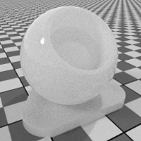

A diffuse transmissive dielectric material

| Display name | Description |
| ------------ | ----------- |
| Diffuse color | The color of the material |
| Translucence color | The color of the volume of the material |
| Translucence weight | Fraction of the incoming light that should be visible on the backside |
| Roughness | Higher roughness values lead to bigger highlights and blurry reflections |
| IOR | Determines reflectivity |
| Bumps | Attach bump or normal maps here |

| Display name | Type | Parameter | Default |
| ------------ | ---- | --------- | ------- |
| Diffuse color | `color` | `surface_color` | `color(0.95)` 
| Translucence color | `color` | `translucent_color` | `color(0.95)` 
| Translucence weight | `float` | `translucency` | `0.5` 
| Roughness | `float` | `roughness` | `0.0` 
| IOR | `uniform float` | `ior` | `1.4` 
| Bumps | `float3` | `normal` | `state::normal()` 

## Thick glass

MDL identifier: `core_definitions::thick_glass_v2`

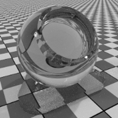

A basic transmissive dielectric with refraction and coloring in the volume

| Display name | Description |
| ------------ | ----------- |
| Transmission color | Colors the light entering the volume, similar to stained glass |
| Volume color | The color of the glass body |
| Roughness | Higher roughness values lead to bigger highlights and blurry reflections |
| IOR | Determines reflectivity as well as amount of refraction |
| Volume reference distance | `Volume color` will be reached at this distance (m). Enter a typical thickness of objects made of this material here. |
| Bumps | Attach bump or normal maps here |
| Abbe number | Controls dispersion. 0 switches dispersion off. Dispersive materials have Abbe numbers between 25 and 85. |

| Display name | Type | Parameter | Default |
| ------------ | ---- | --------- | ------- |
| Transmission color | `color` | `transmission_color` | `color(1.0)` 
| Volume color | `uniform color` | `glass_color` | `color(0.95)` 
| Roughness | `float` | `roughness` | `0.0` 
| IOR | `uniform float` | `ior` | `1.4` 
| Volume reference distance | `uniform float` | `base_thickness` | `0.1` 
| Bumps | `float3` | `normal` | `state::normal()` 
| Abbe number | `uniform float` | `abbe_number` | `0.0` 

## Thick translucent

MDL identifier: `core_definitions::thick_translucent_v2`

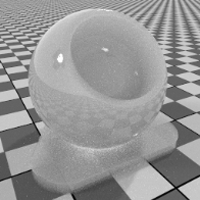

A subsurface scattering material

| Display name | Description |
| ------------ | ----------- |
| Transmission color | The color of the material |
| Volume color | The color of the volume at `Volume reference distance` |
| Volume scattering | Amount of scattering for objects at `Volume reference distance` |
| Reflection roughness | Higher roughness values lead to bigger highlights and blurry reflections |
| Reflection weight | Overall reflectivity of the material |
| Volume reference distance | `Volume color` and `Volume scattering` will be reached at this distance (m). Enter a typical thickness of objects made of this material here. |
| Bumps | Attach bump or normal maps here |
| IOR | Determines reflectivity as well as amount of refraction |
| Abbe number | Controls dispersion. A value of 0 switches dispersion off, Dispersive materials have Abbe numbers between 25 and 85. |

| Display name | Type | Parameter | Default |
| ------------ | ---- | --------- | ------- |
| Transmission color | `color` | `transmission_color` | `color(0.95)` 
| Volume color | `uniform color` | `volume_color` | `color(0.95)` 
| Volume scattering | `uniform float` | `volume_scattering` | `0.5` 
| Reflection roughness | `float` | `roughness` | `0.0` 
| Reflection weight | `float` | `reflectivity` | `1.0` 
| Volume reference distance | `uniform float` | `base_thickness` | `0.1` 
| Bumps | `float3` | `normal` | `state::normal()` 
| IOR | `uniform float` | `ior` | `1.4` 
| Abbe number | `uniform float` | `abbe_number` | `0.0` 

## Modifier materials

## Surface blender

MDL identifier: `core_definitions::blend`

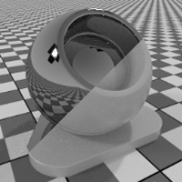

Blend surface characteristics of 2 materials or mask them using a texture

| Display name | Description |
| ------------ | ----------- |
| Base material | The material the blend is based on |
| Blend Material | Surface properties to use for the blend |
| Blend weight | Blend weight or mask texture |

| Display name | Type | Parameter | Default |
| ------------ | ---- | --------- | ------- |
| Base material | `material` | `base` | `scratched_plastic_v2()` 
| Blend Material | `material` | `blend` | `scratched_metal_v2()` 
| Blend weight | `float` | `weight` | `0.0` 

## Surface falloff

MDL identifier: `core_definitions::surface_falloff`

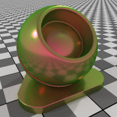

Blend surface characteristics of 2 materials or mask them using a texture

| Display name | Description |
| ------------ | ----------- |
| Base material | The material the blend is based on |
| Blend Material | Surface properties to use for the blend |
| Blend weight facing | Blend weight or mask texture |
| Blend weight edge | Blend weight or mask texture |
| Blend bias | Controls how fast the transition should happen. 5.0 results in fresnel like transition. |

| Display name | Type | Parameter | Default |
| ------------ | ---- | --------- | ------- |
| Base material | `material` | `base` | `scratched_plastic_v2()` 
| Blend Material | `material` | `blend` | `scratched_metal_v2()` 
| Blend weight facing | `float` | `facing_weight` | `0.0` 
| Blend weight edge | `float` | `edge_weight` | `1.0` 
| Blend bias | `float` | `blend_bias` | `1.0` 

## Apply clear coating

MDL identifier: `core_definitions::apply_clearcoat_v2`

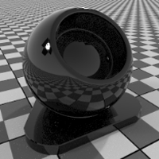

Apply clear coat to an existing material

| Display name | Description |
| ------------ | ----------- |
| Base material | The material that will get a clear coating applied |
| IOR | Determines reflectivity of the clear coat |
| Reflection roughness | Determines roughness of the clear coat |
| Coat visibility | Determines visibility of the clear coat |
| Bumps | Attach bump or normal maps here |
| Coat filter color | For simulating coatings with colored resins that modulate the color of underlying layers |

| Display name | Type | Parameter | Default |
| ------------ | ---- | --------- | ------- |
| Base material | `material` | `base` | `diffuse(color(0.0))` 
| IOR | `uniform float` | `ior` | `1.6` 
| Reflection roughness | `float` | `roughness` | `0.0` 
| Coat visibility | `float` | `visibility` | `1.0` 
| Bumps | `float3` | `normal` | `state::normal()` 
| Coat filter color | `color` | `coat_filter_color` | `color(1.0)` 

## Apply thin film

MDL identifier: `core_definitions::apply_thinfilm`

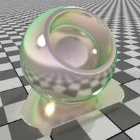

Apply thin film to an existing material

| Display name | Description |
| ------------ | ----------- |
| Base material | The material that will get shows a thin film effect |
| IOR | The IOR of the thin film interface |
| Thickness | Thickness of the thin film in nm |

| Display name | Type | Parameter | Default |
| ------------ | ---- | --------- | ------- |
| Base material | `material` | `base` | `scratched_metal_v2()` 
| IOR | `uniform float` | `ior` | `1.6` 
| Thickness | `float` | `thickness` | `400.0` 

## Apply thin metal coating

MDL identifier: `core_definitions::apply_metalcoat_v2`

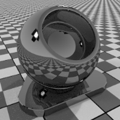

Apply metal coat to an existing material

| Display name | Description |
| ------------ | ----------- |
| Base material | The material that will get a metallic coating applied |
| Reflection color | The color of the metal |
| Reflection weight | The opacity of the coat |
| Reflection roughness | Determines roughness of the metal coat |
| Bumps | Attach bump or normal maps here |

| Display name | Type | Parameter | Default |
| ------------ | ---- | --------- | ------- |
| Base material | `material` | `base` | `diffuse(color(0.0))` 
| Reflection color | `color` | `metal_color` | `color(0.95)` 
| Reflection weight | `float` | `visibility` | `0.3` 
| Reflection roughness | `float` | `roughness` | `0.0` 
| Bumps | `float3` | `normal` | `state::normal()` 

## Apply a cover of dust

MDL identifier: `core_definitions::apply_dustcover`

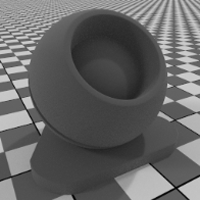

Apply a diffuse cover of dust or dirt

| Display name | Description |
| ------------ | ----------- |
| Base material | The material that will get a clear coating applied |
| Dust color | The color of the dust |
| Dust density | The opacity of the cover |
| Dust amount | How dusty the material is |
| Bumps | Attach bump or normal maps here |

| Display name | Type | Parameter | Default |
| ------------ | ---- | --------- | ------- |
| Base material | `material` | `base` | `diffuse(color(0.0))` 
| Dust color | `color` | `dust_color` | `color(0.7)` 
| Dust density | `float` | `visibility` | `1.0` 
| Dust amount | `uniform float` | `dust_density` | `0.5` 
| Bumps | `float3` | `normal` | `state::normal()` 

## Apply a color falloff

MDL identifier: `core_definitions::apply_colorfalloff_v2`

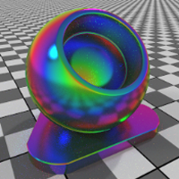

Makes the color view dependent

| Display name | Description |
| ------------ | ----------- |
| Base material | The material that will get a clear coating applied |
| Color 1 | Color 1 (facing direction) |
| Color 2 | Color 2 |
| Color 3 | Color 3 |
| Color 4 | Color 4 |
| Color 5 | Color 5 (object edges) |

| Display name | Type | Parameter | Default |
| ------------ | ---- | --------- | ------- |
| Base material | `material` | `base` | `scratched_metal_v2(metal_color: color(1.0))` 
| Color 1 | `uniform color` | `color_0` | `color(1.0, 1.0, 1.0)` 
| Color 2 | `uniform color` | `color_1` | `color(0.0, 0.0, 0.0)` 
| Color 3 | `uniform color` | `color_2` | `color(0.0, 0.0, 0.0)` 
| Color 4 | `uniform color` | `color_3` | `color(1.0, 1.0, 1.0)` 
| Color 5 | `uniform color` | `color_4` | `color(0.0, 0.0, 0.0)` 

## Apply flake coating

MDL identifier: `core_definitions::apply_metallicflakes`

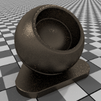

Apply layer of metallic flakes to an existing material

| Display name | Description |
| ------------ | ----------- |
| Base material | The material that will get a flake layer applied |
| Color | The color of the flakes |
| Roughness | Determines roughness of the metallic flakes |
| Flake size | Determines size of the metallic flakes, in mm |
| Flake amount | Determines amount of visible metallic flakes |
| Flake opacity | Determines visibility of the metallic flakes |
| Flake orientation randomness | Larger numbers will increase the sparkle radius around highlights |

| Display name | Type | Parameter | Default |
| ------------ | ---- | --------- | ------- |
| Base material | `material` | `base` | `diffuse(color(0.0))` 
| Color | `color` | `flake_color` | `color(0.9,0.9,0.9)` 
| Roughness | `float` | `roughness` | `0.0` 
| Flake size | `uniform float` | `size` | `1.0` 
| Flake amount | `uniform float` | `amount` | `0.5` 
| Flake opacity | `uniform float` | `opacity` | `0.5` 
| Flake orientation randomness | `uniform float` | `bump` | `1.0` 

## Flaky paint

MDL identifier: `core_definitions::flake_paint`

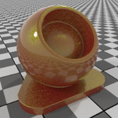

A multi layer paint material containing flakes

| Display name | Description |
| ------------ | ----------- |
| Base color | The color of the base paint |
| Flake color | The color of the flakes |
| Flake roughness | Determines roughness of the metallic flakes |
| Flake size | Determines size of the metallic flakes, in mm |
| Flake amount | Determines amount of visible metallic flakes |
| Flake weight | Determines visibility of the metallic flakes |
| Flake orientation randomness | Larger numbers will increase the sparkle radius around highlights |
| IOR | Determines reflectivity of the clear coat |
| Coat roughness | Determines roughness of the clear coat |
| Coat bump | Attach bump or normal maps here |

| Display name | Type | Parameter | Default |
| ------------ | ---- | --------- | ------- |
| Base color | `color` | `base_color` | `color(0.3,0.31,0.31)` 
| Flake color | `color` | `flake_color` | `color(0.6,1,0.6)` 
| Flake roughness | `float` | `roughness` | `0.15` 
| Flake size | `uniform float` | `size` | `1.0` 
| Flake amount | `uniform float` | `amount` | `0.4` 
| Flake weight | `uniform float` | `opacity` | `0.8` 
| Flake orientation randomness | `uniform float` | `bump` | `1.0` 
| IOR | `uniform float` | `ior` | `1.6` 
| Coat roughness | `float` | `coat_roughness` | `0.0` 
| Coat bump | `float3` | `coat_bump` | `state::normal()` 

## Add cut-outs

MDL identifier: `core_definitions::add_cutout`

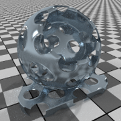

Adds cut-outs to existing materials. Also forces material to be thin-walled. Good for modeling leaves, grass or fences.

| Display name | Description |
| ------------ | ----------- |
| Base material | The material that will get a cut-out |
| Cutout | Determines where the object is visible |

| Display name | Type | Parameter | Default |
| ------------ | ---- | --------- | ------- |
| Base material | `material` | `base` | `scratched_plastic_v2()` 
| Cutout | `float` | `cutout` | `1.0` 

## Add simple sticker

MDL identifier: `core_definitions::add_simple_sticker`

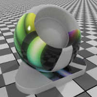

A quick way for adding simple stickers to a material. The sticker is a simple dielectric and needs a mask to define its extent.

| Display name | Description |
| ------------ | ----------- |
| Sticker color | The color of the material |
| Sticker roughness | Higher roughness values lead to bigger highlights and blurry reflections |
| Sticker IOR | Determines reflectivity |
| Sticker reflectivity | Additional Reflectivity control |
| Sticker bumps | Attach bump or normal maps here |
| Sticker mask | Determines extent of the sticker |
| Base material | The material that will get a sticker added |

| Display name | Type | Parameter | Default |
| ------------ | ---- | --------- | ------- |
| Sticker color | `color` | `diffuse_color` | `color(0.5)` 
| Sticker roughness | `float` | `roughness` | `0.05` 
| Sticker IOR | `uniform float` | `ior` | `1.4` 
| Sticker reflectivity | `float` | `reflectivity` | `1.0` 
| Sticker bumps | `float3` | `sticker_normal` | `state::normal()` 
| Sticker mask | `float` | `sticker_mask` | `0.0` 
| Base material | `material` | `base` | `scratched_plastic_v2()` 

## Add global bumpmap

MDL identifier: `core_definitions::add_globalbump`

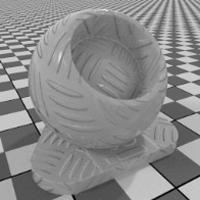

Adds global bumpmap to existing materials. Local bump map of the base material is preserved.

| Display name | Description |
| ------------ | ----------- |
| Base material | The material that will get a bump map |
| Bump | An additional global bump map for the material. Local bump map of the base material is preserved. |

| Display name | Type | Parameter | Default |
| ------------ | ---- | --------- | ------- |
| Base material | `material` | `base` | `scratched_plastic_v2()` 
| Bump | `float3` | `normal` | `state::normal()` 

## Add displacement

MDL identifier: `core_definitions::add_displacement`

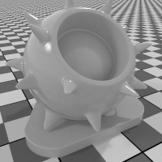

Adds displacement to existing materials

| Display name | Description |
| ------------ | ----------- |
| Base material | The material that will get a bump map |
| Displacement amount | Attach displacement texture here. Note that the object needs to be set up correctly to have good displacement results. |
| Displacement scale | A global scale factor for the displacement amount |

| Display name | Type | Parameter | Default |
| ------------ | ---- | --------- | ------- |
| Base material | `material` | `base` | `scratched_plastic_v2()` 
| Displacement amount | `float` | `displacement` | `0.0` 
| Displacement scale | `uniform float` | `displacement_scale` | `1.0` 

## Add emission

MDL identifier: `core_definitions::add_emission`

Adds emission to a material

| Display name | Description |
| ------------ | ----------- |
| Base material | The material that will get emission added |
| Color | The color of the light |
| Intensity | The brightness of the light source |
| Unit scale | Modeling unit to meter conversion factor |
| Unit for emission | The physical unit of `Intensity` |

| Display name | Type | Parameter | Default |
| ------------ | ---- | --------- | ------- |
| Base material | `material` | `base` | `diffuse(color(0.0))` 
| Color | `color` | `tint` | `color(1.0)` 
| Intensity | `uniform float` | `intensity` | `1000` 
| Unit scale | `uniform float` | `unit_scale` | `1.0` 
| Unit for emission | `uniform emission_type` | `unit` | `lumen_m2` 

## Add thermal emission

MDL identifier: `core_definitions::add_thermal_emission`

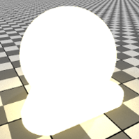

Adds emission to a material, color is based on a `color temperature`

| Display name | Description |
| ------------ | ----------- |
| Base material | The material that will get emission added |
| Temperature | The color temperature of the light in Kelvin |
| Intensity | The brightness of the light source |
| Unit for emission | The physical unit of `Intensity` |

| Display name | Type | Parameter | Default |
| ------------ | ---- | --------- | ------- |
| Base material | `material` | `base` | `diffuse(color(0.0))` 
| Temperature | `uniform float` | `temperature` | `6500.0` 
| Intensity | `uniform float` | `intensity` | `1000` 
| Unit for emission | `uniform emission_type` | `unit` | `lumen_m2` 

## Emissive materials

## Diffuse emission

MDL identifier: `core_definitions::light_omni`

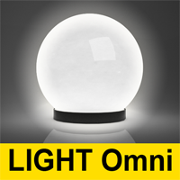

Emissive material emitting in all directions

| Display name | Description |
| ------------ | ----------- |
| Color | The color of the light |
| Intensity | The brightness of the light source |
| Unit scale | Modeling unit to meter conversion factor |
| Unit for emission | The physical unit of `Intensity` |

| Display name | Type | Parameter | Default |
| ------------ | ---- | --------- | ------- |
| Color | `color` | `tint` | `color(1.0)` 
| Intensity | `uniform float` | `intensity` | `1000` 
| Unit scale | `uniform float` | `unit_scale` | `1.0` 
| Unit for emission | `uniform emission_type` | `unit` | `lumen_m2` 

## Spotlight emission

MDL identifier: `core_definitions::light_spot`

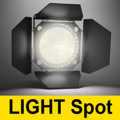

Emissive material emitting focused in one direction

| Display name | Description |
| ------------ | ----------- |
| Color | The color of the light |
| Intensity | The brightness of the light source |
| Unit scale | Modeling unit to meter conversion factor |
| Spot focus | larger values lead to more focused spotlights |
| Unit for emission | The physical unit of `Intensity` |

| Display name | Type | Parameter | Default |
| ------------ | ---- | --------- | ------- |
| Color | `color` | `tint` | `color(1.0)` 
| Intensity | `uniform float` | `intensity` | `1000` 
| Unit scale | `uniform float` | `unit_scale` | `1.0` 
| Spot focus | `uniform float` | `spot_exponent` | `30` 
| Unit for emission | `uniform emission_type` | `unit` | `lumen_m2` 

## IES file based emission

MDL identifier: `core_definitions::light_ies`

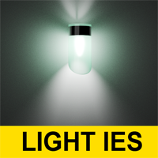

Emissive material emitting as described in an IES file

| Display name | Description |
| ------------ | ----------- |
| IES light profile data | Data to describe the distribution of the light |
| Color | The color of the light |
| Intensity | The brightness of the light source |
| Unit scale | Modeling unit to meter conversion factor |

| Display name | Type | Parameter | Default |
| ------------ | ---- | --------- | ------- |
| IES light profile data | `uniform light_profile` | `profile` | (none) 
| Color | `color` | `tint` | `color(1.0)` 
| Intensity | `uniform float` | `intensity` | `1` 
| Unit scale | `uniform float` | `unit_scale` | `1.0` 

# Texturing functions

## Blend colors

MDL identifier: `core_definitions::blend_colors`

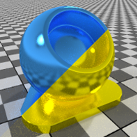

Allows combining textures and colors in varied ways

| Display name | Description |
| ------------ | ----------- |
| Color 1 |  |
| Color 2 |  |
| Blend mode | Describes how Color 1 and Color 2 are combined |
| Blend weight | Defines strength of the effect. At weight 0, only color 1 will be visible. At weight 1, the blend function will have full effect. |
| Linear blend | The blend opperation can either be applied in linear or gamma (2.2) color space |

| Display name | Type | Parameter | Default |
| ------------ | ---- | --------- | ------- |
| Color 1 | `color` | `color_1` | `color(0.0)` 
| Color 2 | `color` | `color_2` | `color(1.0)` 
| Blend mode | `uniform color_layer_mode` | `mode` | `color_layer_blend` 
| Blend weight | `float` | `weight` | `1.0` 
| Linear blend | `uniform bool` | `linear_blend` | `true` 

## Bitmap texture

MDL identifier: `core_definitions::file_texture`

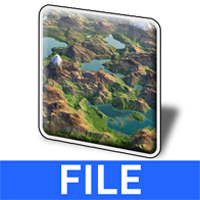

Allows texturing using image files of various file formats

| Display name | Description |
| ------------ | ----------- |
| Bitmap file |  |
| Scalar mode | Defines how the texture applies to scalar parameters |
| Brightness |  |
| Contrast |  |
| Tiling | Controls the scale of the texture on the object |
| Offset | Controls position of the texture on the object |
| Rotation | Rotation angle of the texture in degrees |
| Clip | If set to true, texture will not repeat. Outside of the texture, color will be black and the scalar value will be 0. |
| UV space index | Selects a specific UV space |
| Invert image | Invert image |

| Display name | Type | Parameter | Default |
| ------------ | ---- | --------- | ------- |
| Bitmap file | `uniform texture_2d` | `texture` | (none) 
| Scalar mode | `uniform mono_mode` | `mono_source` | `mono_average` 
| Brightness | `uniform float` | `brightness` | `1.0` 
| Contrast | `uniform float` | `contrast` | `1.0` 
| Tiling | `float2` | `scaling` | `float2(1.0)` 
| Offset | `float2` | `translation` | `float2(0.0)` 
| Rotation | `float` | `rotation` | `0.0` 
| Clip | `uniform bool` | `clip` | `false` 
| UV space index | `uniform int` | `texture_space` | `0` 
| Invert image | `uniform bool` | `invert` | `false` 

## Triplanar Bitmap texture

MDL identifier: `core_definitions::triplanar_file_texture`

Allows texturing using image files of various file formats

| Display name | Description |
| ------------ | ----------- |
| Bitmap file |  |
| Tiling | Controls the scale of the texture on the object |
| Offset | Controls position of the texture on the object |
| Rotation | Rotation angle of the texture in degrees |
| Bitmap file |  |
| Tiling | Controls the scale of the texture on the object |
| Offset | Controls position of the texture on the object |
| Rotation | Rotation angle of the texture in degrees |
| Bitmap file |  |
| Tiling | Controls the scale of the texture on the object |
| Offset | Controls position of the texture on the object |
| Rotation | Rotation angle of the texture in degrees |
| Blend range | Defines the size of the transition area. 0 means hard transition, 1 means blending happens very softly. |
| Mean color | Allows tweaking of the blend function. A value of 0 disables the function. |
| Rotation of origin | Allows manual alignment of the projection with an object |
| Use object space | If off, world space will be used for generating texture coordinates. If on, object space will apply. |

| Display name | Type | Parameter | Default |
| ------------ | ---- | --------- | ------- |
| Bitmap file | `uniform texture_2d` | `texture_1` | (none) 
| Tiling | `float2` | `scaling_1` | `float2(1.0)` 
| Offset | `float2` | `translation_1` | `float2(0.0)` 
| Rotation | `float` | `rotation_1` | `0.0` 
| Bitmap file | `uniform texture_2d` | `texture_2` | `texture_2d()` 
| Tiling | `float2` | `scaling_2` | `float2(1.0)` 
| Offset | `float2` | `translation_2` | `float2(0.0)` 
| Rotation | `float` | `rotation_2` | `0.0` 
| Bitmap file | `uniform texture_2d` | `texture_3` | `texture_2d()` 
| Tiling | `float2` | `scaling_3` | `float2(1.0)` 
| Offset | `float2` | `translation_3` | `float2(0.0)` 
| Rotation | `float` | `rotation_3` | `0.0` 
| Blend range | `float` | `blend_range` | `0.5` 
| Mean color | `uniform color` | `mean` | `color(0.0)` 
| Rotation of origin | `uniform float3` | `rotate_origin` | `float3(0.0)` 
| Use object space | `uniform bool` | `object_space` | `true` 

## Perlin noise texture

MDL identifier: `core_definitions::perlin_noise_texture`

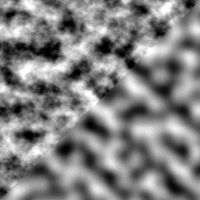

Enable texturing with a random noise pattern

| Display name | Description |
| ------------ | ----------- |
| Color 1 |  |
| Color 2 |  |
| Use object space | If off, UV space will be used. If on, 3D texturing in object space will apply. For applications that do not support object space, world space will be used. |
| Levels | Higher amounts will add detail to the noise |
| Billowing appearance |  |
| Upper threshold | Lowering this value will create bigger areas uniformly colored with Color 1 |
| Lower threshold | Increasing this value will create bigger areas uniformly colored with Color 2 |
| Tiling | Controls the scale of the texture on the object |
| Offset | Controls position of the texture on the object |
| Rotation | Rotation angle of the texture in degrees |
| UV space index | Only applies if `Use object space` is off. Selects a specific UV space. |

| Display name | Type | Parameter | Default |
| ------------ | ---- | --------- | ------- |
| Color 1 | `color` | `color1` | `color(1.0)` 
| Color 2 | `color` | `color2` | `color(0.0)` 
| Use object space | `uniform bool` | `object_space` | `true` 
| Levels | `uniform int` | `noise_levels` | `3` 
| Billowing appearance | `uniform bool` | `absolute_noise` | `false` 
| Upper threshold | `uniform float` | `noise_threshold_high` | `1.0` 
| Lower threshold | `uniform float` | `noise_threshold_low` | `0.0` 
| Tiling | `float3` | `scaling` | `float3(10.0)` 
| Offset | `float3` | `translation` | `float3(0.0)` 
| Rotation | `float3` | `rotation` | `float3(0.0)` 
| UV space index | `uniform int` | `texture_space` | `0` 

## Perlin noise texture - bump mapping

MDL identifier: `core_definitions::perlin_noise_bump_texture`

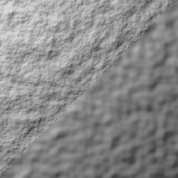

Enable bump-map texturing with a random noise pattern

| Display name | Description |
| ------------ | ----------- |
| Bump strength |  |
| Tiling | Controls the scale of the texture on the object |
| Levels | Higher amounts will add detail to the noise |
| Use object space | If off, UV space will be used. If on, 3D texturing in object space will apply. For applications that do not support object space, world space will be used. |
| Billowing appearance |  |
| Upper threshold | Lowering this value will create bigger areas uniformly colored with Color 1 |
| Lower threshold | Increasing this value will create bigger areas uniformly colored with Color 2 |
| Offset | Controls position of the texture on the object |
| Rotation | Rotation angle of the texture in degrees |
| UV space index | Only applies if `Use object space` is off. Selects a specific UV space. |

| Display name | Type | Parameter | Default |
| ------------ | ---- | --------- | ------- |
| Bump strength | `uniform float` | `factor` | `1.0` 
| Tiling | `float3` | `scaling` | `float3(10.0)` 
| Levels | `uniform int` | `noise_levels` | `1` 
| Use object space | `uniform bool` | `object_space` | `true` 
| Billowing appearance | `uniform bool` | `absolute_noise` | `false` 
| Upper threshold | `uniform float` | `noise_threshold_high` | `1.0` 
| Lower threshold | `uniform float` | `noise_threshold_low` | `0.0` 
| Offset | `float3` | `translation` | `float3(0.0)` 
| Rotation | `float3` | `rotation` | `float3(0.0)` 
| UV space index | `uniform int` | `texture_space` | `0` 

## Cellular noise texture

MDL identifier: `core_definitions::worley_noise_texture`

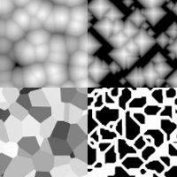

Allow texturing with a cell forming pattern

| Display name | Description |
| ------------ | ----------- |
| Color 1 |  |
| Color 2 |  |
| Use object space | If off, UV space will be used. If on, 3D texturing in object space will apply. For applications that do not support object space, world space will be used. |
| UV space index | Only applies if `Use object space` is off. Selects a specific UV space. |
| Cell type | Cell pattern type |
| Cell shape | The shape of the cell form |
| Upper threshold | Lowering this value will create bigger areas uniformly colored with Color 1 |
| Lower threshold | Increasing this value will create bigger areas uniformly colored with Color 2 |
| Tiling | Controls the scale of the texture on the object |
| Offset | Controls position of the texture on the object |
| Rotation | Rotation angle of the texture in degrees |

| Display name | Type | Parameter | Default |
| ------------ | ---- | --------- | ------- |
| Color 1 | `color` | `color1` | `color(1.0)` 
| Color 2 | `color` | `color2` | `color(0.0)` 
| Use object space | `uniform bool` | `object_space` | `true` 
| UV space index | `uniform int` | `texture_space` | `0` 
| Cell type | `uniform cell_type` | `mode` | `simple_cells` 
| Cell shape | `uniform cell_base` | `metric` | `circular_cells` 
| Upper threshold | `uniform float` | `noise_threshold_high` | `1.0` 
| Lower threshold | `uniform float` | `noise_threshold_low` | `0.0` 
| Tiling | `float3` | `scaling` | `float3(10.0)` 
| Offset | `float3` | `translation` | `float3(0.0)` 
| Rotation | `float3` | `rotation` | `float3(0.0)` 

## Cellular noise texture - bump mapping

MDL identifier: `core_definitions::worley_noise_bump_texture`

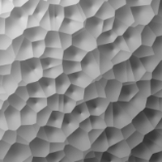

Allow texturing with a cell forming pattern

| Display name | Description |
| ------------ | ----------- |
| Bump strength |  |
| Cell shape | The shape of the cell form |
| Use object space | If off, UV space will be used. If on, 3D texturing in object space will apply. For applications that do not support object space, world space will be used. |
| UV space index | Only applies if `Use object space` is off. Selects a specific UV space. |
| Upper threshold | Lowering this value will create bigger areas uniformly colored with Color 1 |
| Lower threshold | Increasing this value will create bigger areas uniformly colored with Color 2 |
| Tiling | Controls the scale of the texture on the object |
| Offset | Controls position of the texture on the object |
| Rotation | Rotation angle of the texture in degrees |

| Display name | Type | Parameter | Default |
| ------------ | ---- | --------- | ------- |
| Bump strength | `uniform float` | `factor` | `1.0` 
| Cell shape | `uniform cell_base` | `metric` | `circular_cells` 
| Use object space | `uniform bool` | `object_space` | `true` 
| UV space index | `uniform int` | `texture_space` | `0` 
| Upper threshold | `uniform float` | `noise_threshold_high` | `1.0` 
| Lower threshold | `uniform float` | `noise_threshold_low` | `0.0` 
| Tiling | `float3` | `scaling` | `float3(10.0)` 
| Offset | `float3` | `translation` | `float3(0.0)` 
| Rotation | `float3` | `rotation` | `float3(0.0)` 

## Flow noise texture

MDL identifier: `core_definitions::flow_noise_texture`

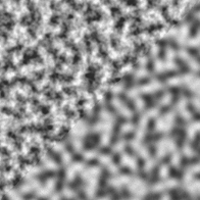

Allow texturing with a 2D noise pattern suitable for waves

| Display name | Description |
| ------------ | ----------- |
| Color 1 |  |
| Color 2 |  |
| Use object space | If off, UV space will be used. If on, 3D texturing in object space will apply. For applications that do not support object space, world space will be used. |
| UV space index | Only applies if `Use object space` is off. Selects a specific UV space. |
| Levels | Higher amounts will add detail to the noise |
| Billowing appearance |  |
| Phase offset | Controls the third dimension of the function |
| Level intensity gain | If multiple levels are used, this parameter specifies a weighting factor for subsequent levels |
| Level scaling | If multiple levels are used, this parameter specifies a global scaling factor for subsequent levels |
| Progressive u scale | If multiple levels are used, this parameter specifies an additional scaling factor in the `u` direction |
| Progressive v offset | If multiple levels are used, this parameter specifies an offset for subsequent levels in the `v` direction |
| Tiling | Controls the scale of the texture on the object |
| Offset | Controls position of the texture on the object |
| Rotation | Rotation angle of the texture in degrees |

| Display name | Type | Parameter | Default |
| ------------ | ---- | --------- | ------- |
| Color 1 | `color` | `color1` | `color(1.0)` 
| Color 2 | `color` | `color2` | `color(0.0)` 
| Use object space | `uniform bool` | `object_space` | `false` 
| UV space index | `uniform int` | `texture_space` | `0` 
| Levels | `uniform int` | `noise_levels` | `3` 
| Billowing appearance | `uniform bool` | `absolute_noise` | `false` 
| Phase offset | `uniform float` | `phase` | `0.0` 
| Level intensity gain | `uniform float` | `level_gain` | `0.5` 
| Level scaling | `uniform float` | `level_scale` | `2.0` 
| Progressive u scale | `uniform float` | `level_progressive_u_scale` | `1.0` 
| Progressive v offset | `uniform float` | `level_progressive_v_motion` | `0.0` 
| Tiling | `float3` | `scaling` | `float3(10.0)` 
| Offset | `float3` | `translation` | `float3(0.0)` 
| Rotation | `float3` | `rotation` | `float3(0.0)` 

## Flow noise texture - bump mapping

MDL identifier: `core_definitions::flow_noise_bump_texture`

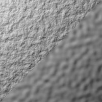

Allow texturing with a 2D noise pattern suitable for waves

| Display name | Description |
| ------------ | ----------- |
| Bump strength |  |
| Tiling | Controls the scale of the texture on the object |
| Levels | Higher amounts will add detail to the noise |
| Use object space | If off, UV space will be used. If on, 3D texturing in object space will apply. For applications that do not support object space, world space will be used. |
| UV space index | Only applies if `Use object space` is off. Selects a specific UV space. |
| Billowing appearance |  |
| Phase offset | Controls the 3rd dimension of the function |
| Level intensity gain | If multiple levels are used, this parameter specifies a weighting factor for subsequent levels |
| Level scaling | If multiple levels are used, this parameter specifies a global scaling factor for subsequent levels |
| Progressive u scale | If multiple levels are used, this parameter specifies an additional scaling factor in the `u` direction |
| Progressive v offset | If multiple levels are used, this parameter specifies an offset for subsequent levels in the `v` direction |
| Offset | Controls position of the texture on the object |
| Rotation | Rotation angle of the texture in degrees |

| Display name | Type | Parameter | Default |
| ------------ | ---- | --------- | ------- |
| Bump strength | `uniform float` | `factor` | `1.0` 
| Tiling | `float3` | `scaling` | `float3(10.0)` 
| Levels | `uniform int` | `noise_levels` | `1` 
| Use object space | `uniform bool` | `object_space` | `false` 
| UV space index | `uniform int` | `texture_space` | `0` 
| Billowing appearance | `uniform bool` | `absolute_noise` | `false` 
| Phase offset | `uniform float` | `phase` | `0.0` 
| Level intensity gain | `uniform float` | `level_gain` | `0.5` 
| Level scaling | `uniform float` | `level_scale` | `2.0` 
| Progressive u scale | `uniform float` | `level_progressive_u_scale` | `1.0` 
| Progressive v offset | `uniform float` | `level_progressive_v_motion` | `0.0` 
| Offset | `float3` | `translation` | `float3(0.0)` 
| Rotation | `float3` | `rotation` | `float3(0.0)` 

## 3D checker texture

MDL identifier: `core_definitions::checker_texture`

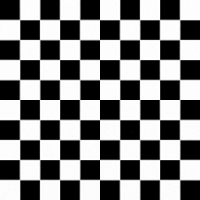

Allows texturing a checkerboard pattern

| Display name | Description |
| ------------ | ----------- |
| Color 1 |  |
| Color 2 |  |
| Tiling | Controls the scale of the texture on the object |
| Offset | Controls position of the texture on the object |
| Use object space | If off, UV space will be used. If on, 3D texturing in object space will apply. For applications that do not support object space, world space will be used. |
| Blur |  |
| Rotation | Rotation angle of the texture in degrees |
| UV space index | Only applies if `Use object space` is off. Selects a specific UV space. |

| Display name | Type | Parameter | Default |
| ------------ | ---- | --------- | ------- |
| Color 1 | `color` | `color1` | `color(1.0)` 
| Color 2 | `color` | `color2` | `color(0.0)` 
| Tiling | `float3` | `scaling` | `float3(10.0)` 
| Offset | `float3` | `translation` | `float3(0.0)` 
| Use object space | `uniform bool` | `object_space` | `false` 
| Blur | `uniform float` | `blur` | `0` 
| Rotation | `float3` | `rotation` | `float3(0.0)` 
| UV space index | `uniform int` | `texture_space` | `0` 

## 3D checker texture - bump mapping

MDL identifier: `core_definitions::checker_bump_texture`

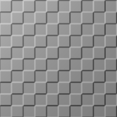

Allows texturing a checkerboard pattern

| Display name | Description |
| ------------ | ----------- |
| Bump strength |  |
| Blur |  |
| Use object space | If off, UV space will be used. If on, 3D texturing in object space will apply. For applications that do not support object space, world space will be used. |
| Tiling | Controls the scale of the texture on the object |
| Offset | Controls position of the texture on the object |
| Rotation | Rotation angle of the texture in degrees |
| UV space index | Only applies if `Use object space` is off. Selects a specific UV space. |

| Display name | Type | Parameter | Default |
| ------------ | ---- | --------- | ------- |
| Bump strength | `uniform float` | `factor` | `1.0` 
| Blur | `uniform float` | `blur` | `0` 
| Use object space | `uniform bool` | `object_space` | `false` 
| Tiling | `float3` | `scaling` | `float3(10.0)` 
| Offset | `float3` | `translation` | `float3(0.0)` 
| Rotation | `float3` | `rotation` | `float3(0.0)` 
| UV space index | `uniform int` | `texture_space` | `0` 

## Bitmap texture, bump

MDL identifier: `core_definitions::file_bump_texture`

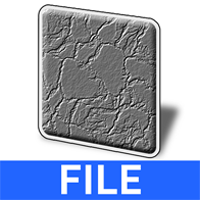

Allows texturing using image files of various file formats

| Display name | Description |
| ------------ | ----------- |
| Bitmap file |  |
| Bump mode | Defines how the texture is evaluated to create the bumps |
| Tiling | Controls the scale of the texture on the object |
| Offset | Controls position of the texture on the object |
| Rotation | Rotation angle of the texture in degrees |
| Clip | If set to true, texture will not repeat. Outside of the texture the surface will be flat |
| Bump strength |  |
| UV space index | Selects a specific UV space |

| Display name | Type | Parameter | Default |
| ------------ | ---- | --------- | ------- |
| Bitmap file | `uniform texture_2d` | `texture` | (none) 
| Bump mode | `uniform mono_mode` | `bump_source` | `mono_average` 
| Tiling | `float2` | `scaling` | `float2(1.0)` 
| Offset | `float2` | `translation` | `float2(0.0)` 
| Rotation | `float` | `rotation` | `0.0` 
| Clip | `uniform bool` | `clip` | `false` 
| Bump strength | `uniform float` | `factor` | `1` 
| UV space index | `uniform int` | `texture_space` | `0` 

## Normal map texture

MDL identifier: `core_definitions::normalmap_texture`

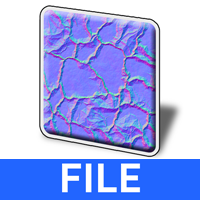

Allows the use of tangent space normal maps

| Display name | Description |
| ------------ | ----------- |
| Normalmap file |  |
| Tiling | Controls the scale of the texture on the object |
| Offset | Controls position of the texture on the object |
| Rotation | Rotation angle of the texture in degrees |
| Clip | If set to true, texture will not repeat. Outside of the texture the surface will be flat. |
| Strength |  |
| UV space index | Selects a specific UV space |
| Flip V | Flip handedness of the tangent space |

| Display name | Type | Parameter | Default |
| ------------ | ---- | --------- | ------- |
| Normalmap file | `uniform texture_2d` | `texture` | (none) 
| Tiling | `float2` | `scaling` | `float2(1.0)` 
| Offset | `float2` | `translation` | `float2(0.0)` 
| Rotation | `float` | `rotation` | `0.0` 
| Clip | `uniform bool` | `clip` | `false` 
| Strength | `uniform float` | `factor` | `1` 
| UV space index | `uniform int` | `texture_space` | `0` 
| Flip V | `uniform bool` | `flip` | `false` 

## Triplanar Normalmap texture

MDL identifier: `core_definitions::triplanar_normalmap_texture`

Allows texturing using image files of various file formats

| Display name | Description |
| ------------ | ----------- |
| Bitmap file |  |
| Tiling | Controls the scale of the texture on the object |
| Offset | Controls position of the texture on the object |
| Rotation | Rotation angle of the texture in degrees |
| Flip V | Flip handedness of the tangent space |
| Bitmap file |  |
| Tiling | Controls the scale of the texture on the object |
| Offset | Controls position of the texture on the object |
| Rotation | Rotation angle of the texture in degrees |
| Flip V | Flip handedness of the tangent space |
| Bitmap file |  |
| Tiling | Controls the scale of the texture on the object |
| Offset | Controls position of the texture on the object |
| Rotation | Rotation angle of the texture in degrees |
| Flip V | Flip handedness of the tangent space |
| Blend range | Defines the size of the transition area. 0 means hard transition, 1 means blending happens very softly. |
| Strength | Overall strength of the normalmap |
| Rotation of origin | Allows manual alignment of the projection with an object |
| Use object space | If off, world space will be used for generating texture coordinates. If on, object space will apply. |

| Display name | Type | Parameter | Default |
| ------------ | ---- | --------- | ------- |
| Bitmap file | `uniform texture_2d` | `texture_1` | (none) 
| Tiling | `float2` | `scaling_1` | `float2(1.0)` 
| Offset | `float2` | `translation_1` | `float2(0.0)` 
| Rotation | `float` | `rotation_1` | `0.0` 
| Flip V | `uniform bool` | `flip_1` | `false` 
| Bitmap file | `uniform texture_2d` | `texture_2` | `texture_2d()` 
| Tiling | `float2` | `scaling_2` | `float2(1.0)` 
| Offset | `float2` | `translation_2` | `float2(0.0)` 
| Rotation | `float` | `rotation_2` | `0.0` 
| Flip V | `uniform bool` | `flip_2` | `false` 
| Bitmap file | `uniform texture_2d` | `texture_3` | `texture_2d()` 
| Tiling | `float2` | `scaling_3` | `float2(1.0)` 
| Offset | `float2` | `translation_3` | `float2(0.0)` 
| Rotation | `float` | `rotation_3` | `0.0` 
| Flip V | `uniform bool` | `flip_3` | `false` 
| Blend range | `float` | `blend_range` | `0.5` 
| Strength | `float` | `strength` | `1.0` 
| Rotation of origin | `uniform float3` | `rotate_origin` | `float3(0.0)` 
| Use object space | `uniform bool` | `object_space` | `true` 

# Enumerations

## User interface group

MDL identifier: `core_definitions::material_type`

User interface grouping hint for materials

| Field | Index | Description |
| ----- | ----- | ----------- |
| `simple_material` | `0` | Simple material |
| `complex_material` | `1` | Complex material |
| `combiner_material` | `2` | Combiner material |
| `modifier_material` | `3` | Material modifier |

## Emission mode

MDL identifier: `core_definitions::emission_type`

Emission mode definition for light sources

| Field | Index | Description |
| ----- | ----- | ----------- |
| `lumen_m2` | `0` | lumen/m2 |
| `lumen` | `1` | lumen |
| `candela` | `2` | candela |
| `nit` | `3` | nit (candela/m2) |

## Worley noise cell type

MDL identifier: `core_definitions::cell_type`

Behavior of the Worley noise cell

| Field | Index | Description |
| ----- | ----- | ----------- |
| `simple_cells` | `0` | Simple cells |
| `crystal_cells` | `1` | Crystal cells |
| `bordered_cells` | `2` | Bordered cells |

## Worley noise cell shape

MDL identifier: `core_definitions::cell_base`

Shape of the Worley noise cell

| Field | Index | Description |
| ----- | ----- | ----------- |
| `circular_cells` | `0` | Circle base |
| `diamond_cells` | `1` | Diamond base |

